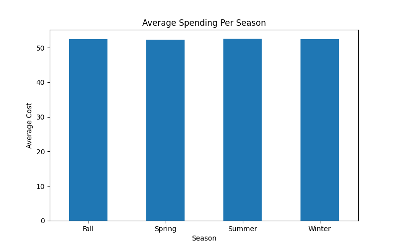
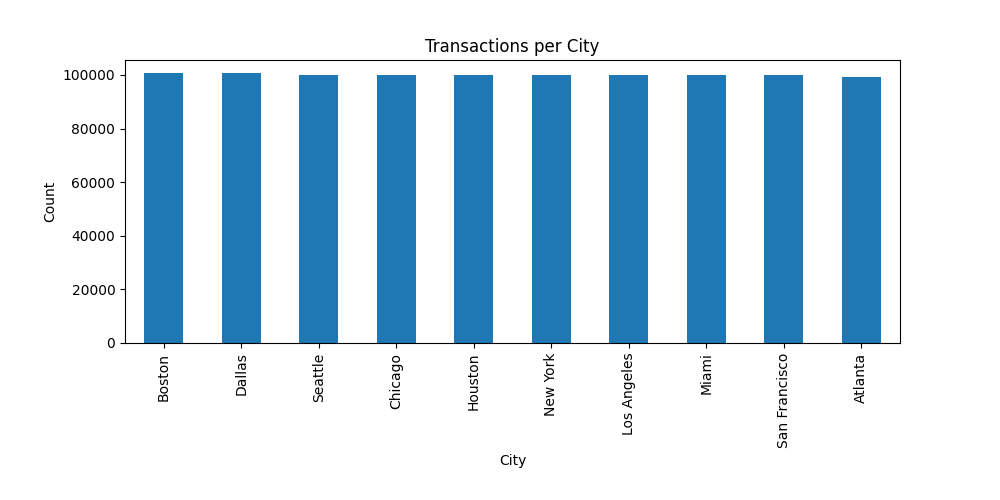
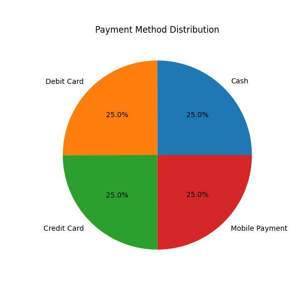
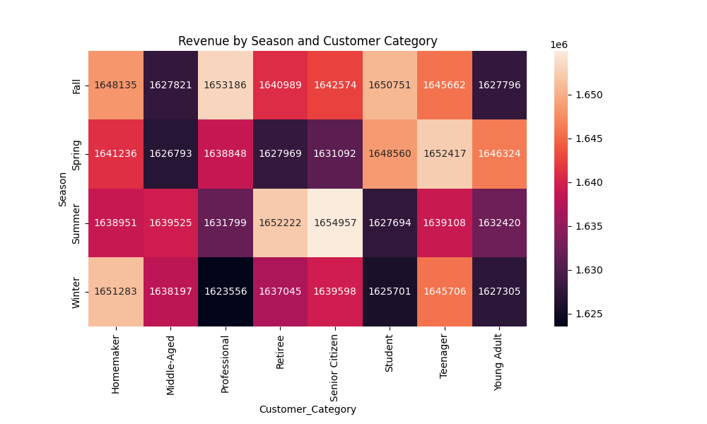

# Retail Transaction Insights

A retail analytics project built using Python, Pandas, Matplotlib, and Seaborn to analyze customer transactions, promotional impact, and seasonal sales trends.

## Project Structure

```text
retail-transaction-insights/
│
├── data_set/
│   └── retail_transactions.csv
│
├── screenshots/
│   ├── task5_seasonality.png
│   ├── task6_average_spending_season.png
│   ├── task6_payment_method_distribution.png
│   └── task6_revenue_season_customer_category.png
│
├── .venv/
├── main.py
├── pyproject.toml
├── uv.lock
└── README.md
```

## Tasks Overview

### Task 1: Data Preparation
The dataset is prepared for analysis by converting the Date column into a proper date format and extracting useful information such as Year, Month, and Day of the Week.
The Product column is transformed into a list format so individual products can be analyzed more easily.
Finally, the first five rows of the cleaned dataset are displayed to verify that the data preparation steps were successful.
```text
Task 1: Data Preparation
**************************
   Transaction_ID                Date      Customer_Name                                        Product  Total_Items  Total_Cost  Payment_Method           City        Store_Type  Discount_Applied Customer_Category  Season                   Promotion  Year     Month  DayOfWeek
0      1000000000 2022-01-21 06:27:29       Stacey Price          [Ketchup, Shaving Cream, Light Bulbs]            3       71.65  Mobile Payment    Los Angeles    Warehouse Club              True         Homemaker  Winter                         NaN  2022   January     Friday
1      1000000001 2023-03-01 13:01:21   Michelle Carlson  [Ice Cream, Milk, Olive Oil, Bread, Potatoes]            2       25.93            Cash  San Francisco   Specialty Store              True      Professional    Fall      BOGO (Buy One Get One)  2023     March  Wednesday
2      1000000002 2024-03-21 15:37:04        Lisa Graves                                      [Spinach]            6       41.49     Credit Card        Houston  Department Store              True      Professional  Winter                         NaN  2024     March   Thursday
3      1000000003 2020-10-31 09:59:47  Mrs. Patricia May                             [Tissues, Mustard]            1       39.34  Mobile Payment        Chicago          Pharmacy              True         Homemaker  Spring                         NaN  2020   October   Saturday
4      1000000004 2020-12-10 00:59:59     Susan Mitchell                                    [Dish Soap]           10       16.42      Debit Card        Houston   Specialty Store             False       Young Adult  Winter  Discount on Selected Items  2020  December   Thursday
```
### Task 2: Basic Exploration
The analysis helps understand the overall business activity by finding the total number of purchases and how many different customers visited the store.
It identifies the most popular products that customers buy frequently, helping understand customer preferences and demand trends.
It also shows which cities generate the most transactions, helping identify locations with the highest sales activity.
```text
Task 2: Basic Exploration
**************************

Total Transactions: 1000000

Unique Customers: 329738

Top 5 Products
---------------
Product
Toothpaste    73324
Ice Cream     37094
Soap          37076
Jam           36956
Orange        36928
Name: count, dtype: int64

Transactions by City
---------------------
City
Boston           100566
Dallas           100559
Seattle          100167
Chicago          100059
Houston          100050
New York         100007
Los Angeles       99879
Miami             99839
San Francisco     99808
Atlanta           99066
Name: count, dtype: int64
```
### Task 3: Customer Behavior
The analysis helps understand customer purchasing behavior by identifying how much different customer groups spend on average.
It shows the preferred payment methods used by each customer category, helping understand customer payment preferences and trends.
It also analyzes the average number of items purchased across different store types to understand shopping patterns in various retail stores.
```text
Task 3: Customer Behaviour
******************************

Average Spending by Customer Category
----------------------------------------
Customer_Category
Homemaker         52.461417
Middle-Aged       52.411318
Professional      52.525762
Retiree           52.435589
Senior Citizen    52.342672
Student           52.487994
Teenager          52.529091
Young Adult       52.448246
Name: Total_Cost, dtype: float64

Payment Preferences
--------------------
Payment_Method      Cash  Credit Card  Debit Card  Mobile Payment
Customer_Category                                                
Homemaker          31360        31413       31315           31330
Middle-Aged        31078        31049       31198           31311
Professional       31246        31201       31118           31086
Retiree            31269        31408       31051           31344
Senior Citizen     31442        31425       31420           31198
Student            31307        31058       31287           31190
Teenager           31203        31467       31322           31327
Young Adult        31325        30964       31363           30925

Average Items per Store Type
------------------------------
Store_Type
Convenience Store    5.505574
Department Store     5.495547
Pharmacy             5.498182
Specialty Store      5.508395
Supermarket          5.485767
Warehouse Club       5.482233
Name: Total_Items, dtype: float64
```
### Task 4: Promotion & Discount
The analysis evaluates how discounts and promotional offers influence customer purchasing behavior and spending patterns.
It compares average spending between transactions with and without discounts to understand the impact of discounts on sales.
It also identifies which promotions encourage customers to buy more items and generate higher transaction value.

```text
Task 4: Promotion & Discount
******************************

Discount Impact
--------------------
Discount_Applied
False    52.423512
True     52.486915
Name: Total_Cost, dtype: float64

Average Items by Promotion
------------------------------
Promotion
BOGO (Buy One Get One)        5.494351
Discount on Selected Items    5.501248
Name: Total_Items, dtype: float64

Promotion Effectiveness
------------------------------
Promotion
BOGO (Buy One Get One)        52.418500
Discount on Selected Items    52.380922
Name: Total_Cost, dtype: float64
```
### Task 5: Seasonality
The analysis examines seasonal sales trends by calculating the total revenue generated during each season.
It helps identify which seasons contribute the most to overall business revenue and customer spending.
A bar chart is also created to visualize average spending across seasons and understand seasonal purchasing patterns more clearly.
```text
Task 5: Seasonality
**************************

Revenue by Season
--------------------
Season
Fall      13136913.71
Spring    13113238.75
Summer    13116675.79
Winter    13088392.15
Name: Total_Cost, dtype: float64
```

### Task 6: Visualisations
Bar charts, pie charts, and heatmaps are created to visualize city transactions, payment distribution, monthly revenue trends, and seasonal revenue patterns.

**Bar Chart:**

This bar chart compares the total number of transactions across different cities, helping identify locations with the highest customer activity and sales volume.


**Pie Chart:**

This pie chart shows the distribution of different payment methods used by customers, helping understand customer payment preferences and transaction trends.



**Heat Map:**

This heatmap compares revenue across different seasons and customer categories, helping identify customer groups that contribute the most revenue during specific seasons.
